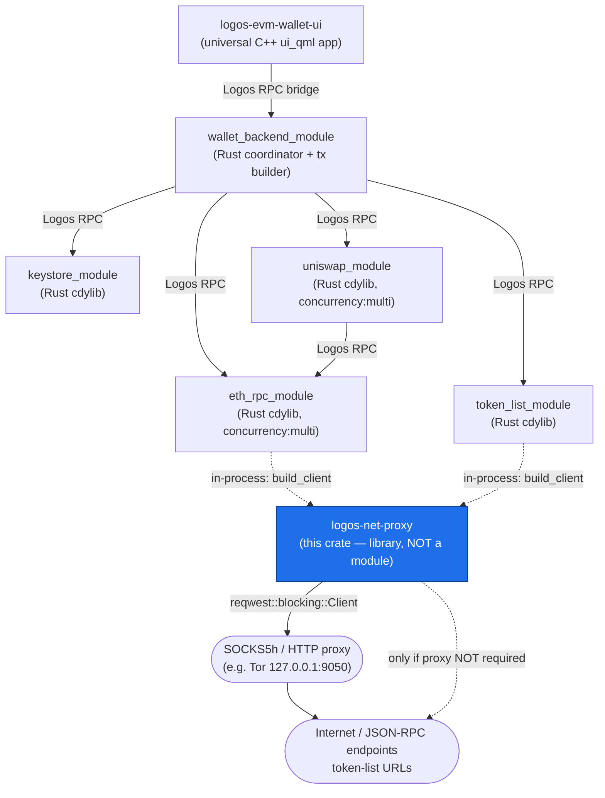
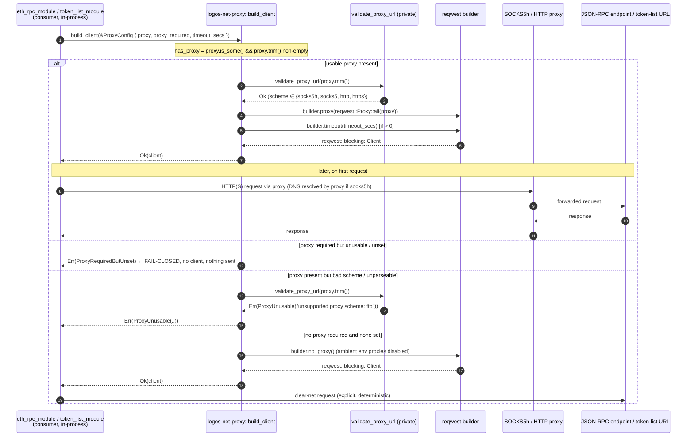

# `logos-net-proxy` — Reference Specification

`logos-net-proxy` is the **single, fail-closed constructor of HTTP clients** for the Logos EVM
wallet's networking modules. It is a small, dependency-free (in the Logos sense — it depends on no
other Logos repo) Rust **library crate**, *not* a Logos module: it exposes no `Q_INVOKABLE`/trait RPC
surface and is never loaded by `logoscore`. Instead, the two networking modules of the wallet —
`eth_rpc_module` and `token_list_module` — obtain *every* outbound `reqwest` client exclusively
through this crate's one public function, [`build_client`](#build_client). Because client
construction is funnelled through a single auditable place, the wallet's privacy posture — *never
send a request in the clear when a proxy is required* — is enforced in **one location** and cannot be
bypassed by a forgotten setter. The crate is built on `reqwest` with `rustls-tls` (pure-Rust TLS at
link time, no system OpenSSL) plus the `socks` feature, so `socks5h://` proxies (remote DNS through
the proxy — exactly what Tor needs) are first-class.

This document is an exhaustive reference for users and future developers. It is grounded entirely in
the repository source (`src/lib.rs`, `Cargo.toml`, `flake.nix`, `README.md`, and the executable
doctest under `doctests/`).

- **GitHub:** `logos-co/logos-evm-net-proxy`
- **Crate name:** `logos-net-proxy` (the package name differs from the repo name)
- **Version:** `0.1.0`
- **Edition:** Rust 2021
- **License:** `MIT OR Apache-2.0`
- **Kind:** plain Rust library crate (the wallet's fail-closed RPC chokepoint)
- **Logos dependencies:** none

---

## Where this repo sits in the EVM wallet system

The "EVM wallet" is a multi-chain Ethereum wallet built as a set of process-isolated Logos modules
that communicate over a Logos transport (QtRO / plain) via a typed RPC bridge. `logos-net-proxy` is
the **privacy keystone** at the bottom of the networking stack. It does not participate in the RPC
bridge at all; it is consumed *in-process* by the Rust networking modules, which then expose their
own module RPC surface to the rest of the wallet.



Solid arrows are Logos inter-module RPC calls; dotted arrows from `eth_rpc`/`token_list` to this
crate are ordinary in-process Rust function calls (`build_client`). Every byte the wallet sends to
the network is emitted by a `reqwest::blocking::Client` that this crate constructed.

> **Vendoring note (from the doctest spec).** The two consumer modules currently *inline* this crate
> — they carry it as `src/proxy.rs` rather than declaring it as a Cargo dependency — and each asserts
> via a unit test that `reqwest::Client::builder` appears only in that one file. The end-to-end
> refusal behavior is exercised by those modules' own doctests; this repo's doctest pins the
> invariant down *at the source*.

---

## Overall architecture

The crate is deliberately tiny: a single module (`src/lib.rs`) with one public function, one public
config struct, and one public error enum, plus one private validator and a six-case unit-test suite.
There is no persistent state, no threads, no I/O at construction time (the proxy connection is lazy).

```mermaid
flowchart TD
    subgraph PUBLIC["Public surface (src/lib.rs)"]
        CFG["struct ProxyConfig<br/>{ proxy: Option&lt;String&gt;,<br/>proxy_required: bool,<br/>timeout_secs: u64 }"]
        NEW["ProxyConfig::new(proxy, proxy_required, timeout_secs)"]
        ERR["enum ProxyError<br/>ProxyRequiredButUnset |<br/>ProxyUnusable(String) |<br/>Build(String)"]
        BUILD["fn build_client(cfg: &ProxyConfig)<br/>-&gt; Result&lt;reqwest::blocking::Client, ProxyError&gt;"]
    end

    subgraph PRIVATE["Private helpers"]
        VAL["fn validate_proxy_url(p: &str)<br/>-&gt; Result&lt;(), ProxyError&gt;<br/>(scheme allow-list)"]
    end

    subgraph EXT["External crates"]
        REQ["reqwest 0.12<br/>(rustls-tls + socks + json + blocking)"]
        URL["url 2"]
        TE["thiserror 2"]
    end

    NEW --> CFG
    BUILD -->|reads| CFG
    BUILD -->|trim + non-empty check| BUILD
    BUILD -->|"if proxy present"| VAL
    VAL -->|url::Url::parse| URL
    BUILD -->|reqwest::Proxy::all / Client::builder| REQ
    BUILD -->|"on any failure"| ERR
    ERR -->|#[derive(Error)]| TE

    subgraph TESTS["#[cfg(test)] mod tests — the fail-closed suite"]
        T1["fail_closed_when_required_and_unset"]
        T2["fail_closed_when_required_and_blank"]
        T3["ok_when_not_required_and_unset"]
        T4["ok_with_socks5h_proxy"]
        T5["rejects_unsupported_scheme"]
        T6["rejects_garbage_proxy"]
    end
    TESTS -.->|exercise| BUILD

    classDef pub fill:#0d1117,stroke:#1f6feb,color:#fff;
    class PUBLIC pub;
```

### Control flow inside `build_client`

1. Start a `reqwest::blocking::Client::builder()`.
2. Compute `has_proxy` = the `proxy` field is `Some` **and**, after `.trim()`, is non-empty. (A
   `None`, `""`, or all-whitespace string is treated identically: *no usable proxy*.)
3. **If `has_proxy`:** trim the string, run `validate_proxy_url` (scheme allow-list), construct
   `reqwest::Proxy::all(p)`, and attach it with `.proxy(...)`. Any failure here is `ProxyUnusable`.
4. **Else (no usable proxy):**
   - If `proxy_required` is `true` → return `Err(ProxyRequiredButUnset)`. **This is the fail-closed
     refusal.**
   - If `proxy_required` is `false` → call `.no_proxy()` to *disable ambient environment proxies*
     (`HTTP_PROXY` / `HTTPS_PROXY` / `ALL_PROXY` etc.) so the clear-net path is explicit and
     deterministic.
5. If `timeout_secs > 0`, set `.timeout(Duration::from_secs(timeout_secs))`; `0` leaves reqwest's
   default.
6. Call `.build()`. Any builder error becomes `ProxyError::Build`.

---

## Communication with dependencies

This crate has **no Logos dependencies** and makes **no outbound Logos RPC calls**. Its only
"communication" is (a) being *called* in-process by the two networking modules, and (b) the
`reqwest` client it returns later opening a connection — through the proxy if one is configured. The
sequence below shows the representative caller→this→network flow, using the real public method name.



---

## Full API reference

The entire public surface is defined in `src/lib.rs`. Three public items: the `ProxyConfig` struct
(with one inherent method `new`), the `ProxyError` enum, and the `build_client` free function.

### `struct ProxyConfig`

Outbound network policy for the client about to be built.

```rust
#[derive(Clone, Debug, Default, PartialEq, Eq)]
pub struct ProxyConfig {
    pub proxy: Option<String>,
    pub proxy_required: bool,
    pub timeout_secs: u64,
}
```

**Fields**

| Field | Type | Meaning |
|---|---|---|
| `proxy` | `Option<String>` | Proxy URL, e.g. `socks5h://127.0.0.1:9050`. `socks5h` resolves DNS through the proxy (privacy-preferred, the right choice for Tor). `None` means no proxy is configured. A `Some("")` or all-whitespace value is treated as *no usable proxy* (trimmed and length-checked in `build_client`). |
| `proxy_required` | `bool` | When `true`, a request **must** traverse a proxy. If `proxy` is `None` or unusable, `build_client` **fails closed** (returns `Err(ProxyRequiredButUnset)`) instead of building a clear-net client. When `false`, a missing proxy is allowed and yields an explicit no-proxy client. |
| `timeout_secs` | `u64` | Total per-request timeout in seconds, applied via `.timeout(Duration::from_secs(..))`. `0` leaves reqwest's default (no explicit timeout set). |

**Derives.** `Clone, Debug, Default, PartialEq, Eq` — so a `ProxyConfig` can be cheaply copied,
debug-printed, compared, and default-constructed (`Default` yields `proxy: None`,
`proxy_required: false`, `timeout_secs: 0`).

#### `ProxyConfig::new`

```rust
pub fn new(proxy: Option<String>, proxy_required: bool, timeout_secs: u64) -> Self
```

A trivial positional constructor; equivalent to the struct literal. Parameters map one-to-one to the
fields above.

**Example**

```rust
use logos_net_proxy::ProxyConfig;

// Require Tor; 30s timeout.
let cfg = ProxyConfig::new(Some("socks5h://127.0.0.1:9050".into()), true, 30);

// Equivalent struct literal:
let cfg = ProxyConfig {
    proxy: Some("socks5h://127.0.0.1:9050".into()),
    proxy_required: true,
    timeout_secs: 30,
};
```

---

### `enum ProxyError`

Why a client could not be constructed. Implements `std::error::Error` and `Display` via
`#[derive(thiserror::Error)]`; also `#[derive(Debug)]`.

```rust
#[derive(Debug, Error)]
pub enum ProxyError {
    ProxyRequiredButUnset,
    ProxyUnusable(String),
    Build(String),
}
```

| Variant | Payload | When returned | `Display` string |
|---|---|---|---|
| `ProxyRequiredButUnset` | — | `proxy_required == true` and no usable proxy (`None`, `""`, or whitespace). **The fail-closed case.** | `proxy required but none configured (fail-closed: refusing to send in the clear)` |
| `ProxyUnusable(String)` | detail string | A proxy URL was supplied but is unparseable, has an unsupported scheme, or `reqwest::Proxy::all` rejected it. | `proxy URL is invalid or unsupported: {0}` |
| `Build(String)` | reqwest error string | `reqwest`'s `.build()` itself failed (e.g. a TLS/backend init error). | `failed to build HTTP client: {0}` |

The detail string in `ProxyUnusable` is constructed in two forms: for a parse failure it is
`"{url}: {parse_error}"`; for a disallowed scheme it is `"unsupported proxy scheme: {scheme}"`; for a
`reqwest::Proxy::all` failure it is the reqwest error's `to_string()`.

---

### `build_client`

```rust
pub fn build_client(cfg: &ProxyConfig) -> Result<reqwest::blocking::Client, ProxyError>
```

Builds a blocking `reqwest::blocking::Client` honoring `cfg`. **This is the only place a client is
constructed in the wallet networking modules.**

**Parameter**

| Name | Type | Meaning |
|---|---|---|
| `cfg` | `&ProxyConfig` | The outbound network policy (see above). Borrowed, not consumed. |

**Return — success.** `Ok(reqwest::blocking::Client)` — a ready-to-use blocking client. The proxy
connection is **lazy**: a configured proxy is recorded on the client but no socket opens until the
first request, so building succeeds even when the proxy is not running.

**Return — error.** `Err(ProxyError)` — one of the three variants above.

**Decision rules (exact, from source).**

| `proxy_required` | `proxy` (after trim) | Outcome |
|---|---|---|
| `true` | `None` / `""` / whitespace | `Err(ProxyRequiredButUnset)` — **fail closed** |
| `true` or `false` | unparseable URL (e.g. `not a url`) | `Err(ProxyUnusable(..))` |
| `true` or `false` | unsupported scheme (e.g. `ftp://`, `https://` is supported, `ftp` is not) | `Err(ProxyUnusable("unsupported proxy scheme: .."))` |
| `true` or `false` | valid `socks5h://` / `socks5://` / `http://` / `https://` | `Ok(client)` with `.proxy(..)` set |
| `false` | `None` / `""` / whitespace | `Ok(client)` with `.no_proxy()` (ambient env proxies disabled) |

> Note: a syntactically valid proxy URL is validated **regardless** of `proxy_required`. If you pass
> a garbage or wrong-scheme `proxy` while `proxy_required == false`, you still get `ProxyUnusable` —
> the crate never silently ignores a malformed proxy you asked for.

**Supported proxy schemes** (allow-list in the private `validate_proxy_url`):

- `socks5h` — **preferred**; DNS is resolved *through* the proxy (no local DNS leak; the right choice
  for Tor).
- `socks5` — DNS resolved locally, traffic through the proxy.
- `http`
- `https`

Anything else (`ftp`, `socks4`, `tor`, empty scheme, …) → `ProxyUnusable("unsupported proxy
scheme: ..")`.

**Example (Rust)**

```rust
use logos_net_proxy::{build_client, ProxyConfig, ProxyError};

// 1) Tor required → returns a client routed through SOCKS5h.
let cfg = ProxyConfig::new(Some("socks5h://127.0.0.1:9050".into()), true, 30);
let client = build_client(&cfg).expect("client via Tor");

// 2) Proxy required but unset → fail closed, nothing is sent in the clear.
let cfg = ProxyConfig::new(None, true, 30);
assert!(matches!(build_client(&cfg), Err(ProxyError::ProxyRequiredButUnset)));

// 3) Clear-net explicitly allowed (no proxy required, none set).
let cfg = ProxyConfig::new(None, false, 30);
let client = build_client(&cfg).expect("explicit clear-net client");

// 4) Bad scheme → ProxyUnusable.
let cfg = ProxyConfig::new(Some("ftp://127.0.0.1:21".into()), true, 30);
assert!(matches!(build_client(&cfg), Err(ProxyError::ProxyUnusable(_))));
```

> There is **no `logoscore` surface**. This crate is a library; you don't load it as a module or
> call it with `logoscore -c`. The way to "drive" it is through `cargo test` / the Nix build (its
> `checkPhase` runs the suite), or transitively by exercising `eth_rpc_module` / `token_list_module`.

---

## Configuration & data model

The crate has **no persisted state and no config files**. The entire data model is the in-memory
`ProxyConfig` value passed by the caller; the consumers derive that value from their own per-chain /
per-module configuration before each `build_client` call.

**The one input shape — `ProxyConfig`:**

```rust
ProxyConfig {
    proxy:          Option<String>,  // e.g. Some("socks5h://127.0.0.1:9050") or None
    proxy_required: bool,            // true ⇒ fail-closed if proxy unusable
    timeout_secs:   u64,             // 0 ⇒ reqwest default; N ⇒ N-second per-request timeout
}
```

**Output shape:** `Result<reqwest::blocking::Client, ProxyError>` (see API reference). The `Client`
holds no Logos-specific state — it is an ordinary reqwest client with the proxy/timeout policy baked
in.

There are **no environment variables read by this crate.** On the contrary: in the no-proxy/
not-required branch it *actively disables* ambient proxy environment variables via `.no_proxy()` so
behavior is deterministic and does not silently pick up `HTTP_PROXY`/`ALL_PROXY`.

---

## Build, run & test

### Dependencies (`Cargo.toml`)

| Crate | Version | Features | Why |
|---|---|---|---|
| `reqwest` | `0.12` (locked `0.12.28`) | `rustls-tls`, `socks`, `json`, `blocking` (`default-features = false`) | The HTTP client. `rustls-tls` keeps the crate pure-Rust at link time (no system OpenSSL); `socks` enables `socks5h://`; `blocking` because `build_client` returns a `blocking::Client`. |
| `url` | `2` (locked `2.5.8`) | — | Parse + scheme-check the proxy URL in `validate_proxy_url`. |
| `thiserror` | `2` (locked `2.0.18`) | — | Derive `Error`/`Display` for `ProxyError`. |

The `[workspace]` empty table in `Cargo.toml` is intentional: it stops cargo from adopting a parent
workspace if the crate is checked out alongside sibling crates.

### Build & test with Cargo

```bash
cargo test          # builds the lib and runs the 6-case fail-closed suite
cargo build         # build only
```

Expected test output: `running 6 tests … test result: ok. 6 passed; 0 failed`.

### Build with Nix (the canonical path)

`flake.nix` exposes the crate as `packages.default` and `checks.default` for the four supported
systems (`aarch64-darwin`, `x86_64-darwin`, `aarch64-linux`, `x86_64-linux`), plus a `devShells.default`
(cargo + rustc + pkg-config). It is built with `rustPlatform.buildRustPackage` using
`cargoLock.lockFile = ./Cargo.lock`. Crucially, `buildRustPackage`'s `checkPhase` runs `cargo test`
by default, so **a successful Nix build IS a green run of the fail-closed invariant suite.**

```bash
# Build (runs cargo test in checkPhase; -L streams the test output into the log)
nix build github:logos-co/logos-evm-net-proxy#default -L

# Run the checks explicitly
nix flake check github:logos-co/logos-evm-net-proxy

# Dev shell
nix develop github:logos-co/logos-evm-net-proxy
```

### How the doctest exercises it

The repo ships one executable doctest, `doctests/net-proxy-runtime.test.yaml`, run by the shared
`logos-doctest` CLI (`github:logos-co/logos-doctest`). It **proves the invariant at the source**:

- A "The invariant" section renders the six-case truth table (which configs refuse vs allow).
- A "Run the fail-closed suite" section runs
  `nix build github:logos-co/logos-evm-net-proxy#default --no-write-lock-file -L -o result`
  and asserts the `result` symlink exists (`check_file: result`). Because the build's `checkPhase`
  is `cargo test`, a green build *is* a green run of all six cases.

Run/regenerate the rendered output locally:

```bash
cd doctests
./run.sh                       # uses github:logos-co/logos-doctest by default
# or with a local checkout of the runner:
DOCTEST="nix run path:../../logos-doctest --" ./run.sh
```

The rendered Markdown is committed at `doctests/outputs/net-proxy-runtime.md`. CI
(`.github/workflows/doctests.yml`) runs the same spec on `ubuntu-latest` and `macos-latest` for every
PR/push to `main`/`master`, publishes a two-column HTML report to GitHub Pages, and (for PRs) posts
the report links as a PR comment. For PRs the spec's `{release}` placeholder is resolved to the PR's
head commit via `--release-for logos-evm-net-proxy=<sha>`, so the report reflects the code under
review (fork PRs fall back to `main`).

---

## Security / invariants — the fail-closed keystone

This crate is the wallet's **privacy chokepoint**, and the whole point is a single, auditable,
un-bypassable invariant.

### The fail-closed invariant (precise)

> **If a proxy is *required* but cannot be honored, `build_client` returns `Err` and never produces a
> client — so nothing can be sent in the clear.** It never falls back to a clear-net client behind
> the caller's back.

Spelling out exactly what forces a **refusal** versus what is **allowed**:

**Refuse (`Err`):**

- `proxy_required == true` **and** `proxy` is `None` → `ProxyRequiredButUnset`.
- `proxy_required == true` **and** `proxy` is `""` or all-whitespace → `ProxyRequiredButUnset`
  (the string is `.trim()`-ed and length-checked, so blank is treated as unset).
- `proxy` is present but **unparseable** as a URL (e.g. `"not a url"`) → `ProxyUnusable`
  (regardless of `proxy_required`).
- `proxy` is present but has an **unsupported scheme** (anything outside
  `socks5h`/`socks5`/`http`/`https`, e.g. `ftp://`) → `ProxyUnusable` (regardless of
  `proxy_required`).
- `reqwest::Proxy::all` rejects an otherwise-parseable proxy → `ProxyUnusable`.
- `reqwest`'s `.build()` fails → `Build`.

**Allow (`Ok(client)`):**

- `proxy_required == false` **and** no usable proxy → client with `.no_proxy()` (ambient env proxies
  disabled; an *explicit, deterministic* clear-net path).
- a **valid** `socks5h://` / `socks5://` / `http://` / `https://` proxy (with either value of
  `proxy_required`) → client routed through that proxy.

### Threat model & defenses

| Threat | Defense in this crate |
|---|---|
| **DNS leak** while using Tor | `socks5h` is the documented/preferred scheme — DNS is resolved by the proxy, not locally. The crate accepts and forwards `socks5h://` unchanged. |
| **Forgotten proxy setter** silently leaking traffic in the clear | Construction is funnelled through one function; `proxy_required` + fail-closed means a missing/blank proxy *refuses* rather than defaults to clear-net. Consumers unit-test that `reqwest::Client::builder` appears only in this code. |
| **Ambient `HTTP_PROXY`/`ALL_PROXY` surprises** | In the no-proxy/not-required branch, `.no_proxy()` explicitly disables environment proxies, so behavior is deterministic and not silently rerouted by env. |
| **Misconfigured/garbage proxy** still letting requests through | Any non-empty `proxy` is validated (URL parse + scheme allow-list + `reqwest::Proxy::all`); a bad value errors out instead of being ignored. |
| **System OpenSSL in the link closure** (supply-chain / portability) | `rustls-tls` (pure-Rust TLS) instead of `native-tls`; `reqwest` is built with `default-features = false`. |

### Caveats / scope

- The crate validates the proxy **URL** (parse + scheme) but does **not** verify the proxy is
  reachable at build time — the connection is lazy. Liveness is the consumer's concern at request
  time.
- `socks5` (without the `h`) resolves DNS locally; it is *permitted* but is not the privacy-preferred
  scheme. Operators wanting no DNS leak should use `socks5h`.
- `http`/`https` proxies are permitted for non-Tor deployments; they do not provide Tor's anonymity.

---

## Concurrency

This crate is **not** a `concurrency: "multi"` Logos module — it is a synchronous library with no
internal threading, no shared mutable state, and no `async`. `build_client` is a pure function of its
`&ProxyConfig` argument that returns a fresh, independent `reqwest::blocking::Client`. It is safe to
call concurrently from many threads; each call produces its own client with no cross-call state.

The clients it returns are blocking (`reqwest::blocking::Client`). Any concurrency in the wallet's
networking is provided by the *consumers* — notably `eth_rpc_module`, which is itself
`concurrency: "multi"` and read-locks its RPC handlers so multiple chains' calls can be in flight at
once. Those consumers obtain their clients from this crate but manage their own dispatch.

---

## File map

| Path | Purpose |
|---|---|
| `src/lib.rs` | The entire crate: `ProxyConfig`, `ProxyError`, `validate_proxy_url` (private), `build_client`, and the `#[cfg(test)]` six-case fail-closed suite. |
| `Cargo.toml` | Package metadata + the three deps (`reqwest`, `url`, `thiserror`); empty `[workspace]` to stay standalone. |
| `Cargo.lock` | Pinned dependency graph (used by the Nix build via `cargoLock.lockFile`). |
| `flake.nix` | Nix package/check/devShell for four systems; build runs `cargo test` in `checkPhase`. |
| `README.md` | Short overview of the API and the fail-closed rules. |
| `doctests/net-proxy-runtime.test.yaml` | Executable doctest proving the invariant (truth table + Nix build = green suite). |
| `doctests/run.sh` | Local runner: executes the spec via `logos-doctest` and regenerates `outputs/`. |
| `doctests/outputs/net-proxy-runtime.md` | Committed rendered doctest output. |
| `.github/workflows/doctests.yml` | CI: run the doctest on ubuntu + macOS, publish HTML report to GitHub Pages, comment on PRs. |
